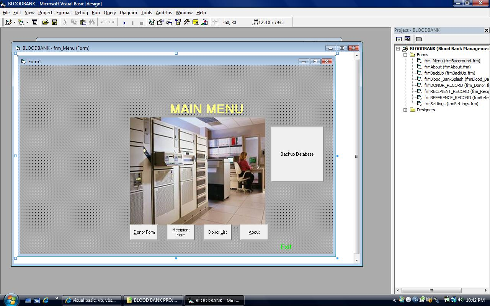



## Blood Bank Management System

### Description

Manage hospital blood bank database
 
### More Info
 
nill

DAO

             |
---                |---
**Submitted On**   |2009-10-21 22:35:48
**By**             |[Suleiman Ibrahim](https://github.com/Planet-Source-Code/PSCIndex/blob/master/ByAuthor/suleiman-ibrahim.md)
**Level**          |Advanced
**User Rating**    |4.7 (14 globes from 3 users)
**Compatibility**  |VB 6\.0
**Category**       |[Databases/ Data Access/ DAO/ ADO](https://github.com/Planet-Source-Code/PSCIndex/blob/master/ByCategory/databases-data-access-dao-ado__1-6.md)
**World**          |[Visual Basic](https://github.com/Planet-Source-Code/PSCIndex/blob/master/ByWorld/visual-basic.md)
**Archive File**   |[Bloob\_Bank21658010212009\.zip](https://github.com/Planet-Source-Code/suleiman-ibrahim-blood-bank-management-system__1-72579/archive/master.zip)

### API Declarations

nill

